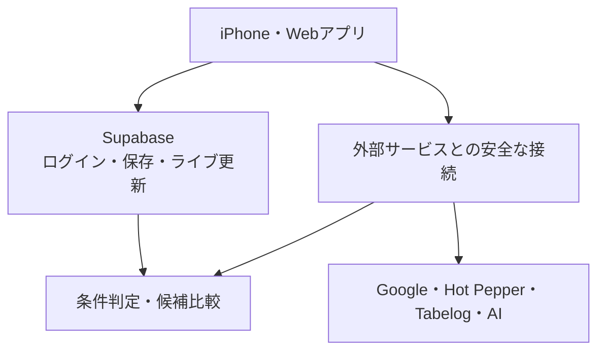

# まとメシ

## 店を「探す」AI ではなく、みんなが納得して「決める」ための AI 幹事

> 参加者の希望を集めたら、条件に合う店は0件。  
> まとメシは誰かの条件を勝手に無視せず、本人だけに最小限の相談をします。  
> 本人が同意すると、その場で再計算され、納得できる候補が3件に。

まとメシは、複数人の会食で起きる「条件の衝突」「言いづらい事情」「幹事への負担」を解決し、全員が納得できる店選びを支えるアプリです。

対象は、東京で 4〜8 人ほどの同僚や友人と行う飲み会・会食。iPhone アプリと Web アプリの両方から参加できます。

---

## まとメシが変える店選び

### 1. 推薦よりも、合意形成が主役

一般的な店探しサービスは、入力された条件から「おすすめの1店」を返します。まとメシが解決するのは、その前にあるもっと難しい問題です。

- 全員の必須条件を本当に満たしているか
- 誰か一人だけが移動や費用を我慢していないか
- 予算や出発地点などの事情を、必要以上に本人の名前と結び付けず扱えるか
- 条件が衝突したとき、誰にどんな相談をすれば前に進むか
- 幹事が理由を理解したうえで、複数の選択肢から決められるか

### 2. 「0件 → 相談 → 3件」がライブで動く

複数の条件をそのまま組み合わせると、候補が0件になることがあります。

```text
候補 0件
   ↓
ボブ本人だけに「個室を半個室まで広げますか？」と提案
   ↓
ボブが明示的に同意
   ↓
全員の画面がリアルタイムで更新
   ↓
異なる強みを持つ候補 3件を表示
```

条件は勝手に変更されません。変更できるのは、その条件を出した本人が同意したときだけです。

### 3. AIに任せる部分と、任せない部分を分けている

AIは自由文を理解し、好みを整理するために使います。一方、予算、移動時間、個室などの必須条件は、同じ入力なら必ず同じ結果になるルールで判定します。

最終的に店を決めるのも、人間の幹事です。まとメシは判断を置き換えるのではなく、判断に必要な情報と合意形成を支えます。

---

## 解決したい課題

会食の店選びが難しいのは、店の数が少ないからではありません。参加者の事情が、曖昧で、言いづらく、ときには両立しないからです。

- 「4,000円以下」「個室」「駅から近い」など、譲れない条件が人によって違う
- 予算や出発地点は、本人の名前と結び付けて共有したくない場合がある
- 「静か」「気軽」「日本らしい」など、検索欄に入れにくい希望がある
- 全条件を満たす店がないと、幹事が誰かに妥協をお願いすることになる
- 1件だけを提示されても、なぜその店なのか、他にどんな選択肢があるのか分からない

まとメシは、店の検索ではなく、その背後にいる人たちの意思決定を設計します。

## 想定する利用者

| 利用者 | 困っていること | まとメシが提供するもの |
| --- | --- | --- |
| 幹事 | 条件収集、衝突の調整、候補比較を一人で背負っている | 進捗の一覧、候補件数、調整の提案、理由付きの複数候補 |
| 参加者 | 細かいフォームでは、自分の希望をうまく伝えられない | 日本語・英語の自由文入力、入力内容の確認 |
| プライバシーを重視する参加者 | 予算や出発地点などを、名前と結び付けて共有したくない | 公開・匿名・非公開の選択と、データベースによるプライバシー保護 |

---

## まとメシでできること

1. 幹事がイベントを作り、招待リンクまたは QR コードを共有
2. 参加者は登録の手間が少ない匿名ログインで参加
3. 必須条件と希望条件を、日本語・英語の自由文で入力
4. 「公開」「匿名」「非公開」から公開範囲を選択
5. 参加者の入力状況と条件の追加をライブで共有
6. 実在する店舗と移動時間を取得し、必須条件を判定
7. 候補がゼロなら、影響を受ける本人だけに最小限の変更を提案
8. 本人の同意後、すべての画面で候補を再計算
9. 「最も公平」「アクセス重視」「コスパ重視」「体験重視」など、強みの違う候補を比較
10. 人間の幹事が最終決定

### 現在実装されている主な機能

- イベント作成、招待リンク、QR コードの生成・読み取り
- 匿名ログインと、任意のメールアカウント
- 自由文から必須条件・希望条件を整理する AI
- 公開・匿名・非公開の3段階のプライバシー
- Google Places を使った実在店舗の検索
- Google Routes を使った公共交通の移動時間比較
- Hot Pepper を使った予算、個室、喫煙、写真の補完
- Tabelog を使った評価、口コミ件数、ディナー予算帯の実験的な補完
- 参加者ごとの移動負担、価格、希望、品質を分けた候補比較
- 本人にだけ届く条件調整の提案と、同意後の再計算
- 幹事だけが行える最終決定
- iPhone と Web のリアルタイム同期
- 外部サービスの鍵がなくても動く、ブラウザ内デモ

---

## なぜ Supabase を使うのか

まとメシでは、参加者の入力が同時に変わり、予算や出発地点など慎重に扱うべき情報も含まれます。Supabase は、ログイン、データ保存、プライバシー保護、リアルタイム更新、外部サービスとの安全な接続を、一つの基盤で実現します。

| まとメシの部分 | Supabase の機能 | 役割とメリット |
| --- | --- | --- |
| 参加者のログイン | Supabase Auth | 匿名ですぐ参加でき、希望者はメールアカウントへ移行できます。全員に本人確認用の識別情報が付くため、他人になりすます操作を防げます |
| イベントと条件の保存 | Supabase Postgres / Data API | 参加者、条件、候補店、移動時間、相談内容、推薦結果を一つの正しい記録として保存できます |
| 言いづらい条件の保護 | Row Level Security（RLS） | 参加者は原則として自分の詳しい条件だけを読み書きできます。画面で隠すだけでなく、データベース自体が他人からの閲覧を拒否できます |
| 全員の画面の同期 | Supabase Realtime | 条件の追加、候補の更新、入力締切、最終決定を、画面の再読み込みなしで共有できます。古い更新が新しい結果を上書きしない仕組みもあります |
| 条件調整と最終決定 | Postgres Functions（RPC） | 本人だけが条件変更に同意できること、幹事だけが最終決定できることを、iPhone/Web 共通のルールとして守れます |
| Google・Hot Pepper・AIとの接続 | Supabase Edge Functions / Secrets | API キーをアプリに置かず、利用者の認証、結果の整理、失敗時の処理を一か所にまとめられます |
| 検索結果の再利用 | Supabase Postgres | 条件が変わるたびに外部サービスへ問い合わせず、取得済みの店舗・移動情報からすばやく再計算できます |
| 将来の曖昧な希望検索 | pgvector | 「落ち着いた店」のような分類しにくい希望を扱う準備ができます。現在は未実装で、必須条件の確認には使いません |

### API キーをクライアントへ渡さない

Google Places、Google Routes、Hot Pepper、言語モデルの API キーは Supabase Secrets に保存します。iPhone と Web アプリは各サービスを直接呼び出さず、Supabase Edge Functions を経由します。Edge Functions がログイン済みの利用者かを確認してから外部サービスへ問い合わせるため、アプリの解析やブラウザの開発者ツールから API キーが漏れるリスクを抑えられます。

### プライバシーを守る仕組み

- 公開：名前と条件をグループに表示できます
- 匿名：条件は共有しますが、誰の条件かは表示しません
- 非公開：本人以外の画面やライブ通知には流しません
- 予算や出発地点などは、利用者の画面だけでなくデータベース側でも慎重な情報として扱います
- 最終店舗の決定は、幹事以外からの操作やイベント外の店舗を拒否するテストを用意しています

## 全体の仕組み



---

## 推薦の考え方

まとメシは、すべてを一つの「AIおすすめ度」に混ぜません。利用者や幹事が理由を理解できるよう、次の観点を分けて表示します。

| 観点 | 確認すること |
| --- | --- |
| 必須条件 | 全員の譲れない条件を満たしているか |
| 公平さ | 移動、費用、アクセシビリティの負担が一人に偏っていないか |
| 希望の満足度 | 各参加者の「できれば」をどの程度かなえているか |
| 店の品質 | 評価と口コミ件数から見て、候補の中でどの位置にあるか |
| 情報の確かさ | 確認済み、未確認、不明、矛盾のどれか |

Google と Tabelog は評価の付け方が異なるため、星の数字をそのまま平均しません。それぞれのサービス内で候補を相対評価してから組み合わせ、片方に情報がない店を不当に減点しないようにしています。

## 「一番近い店」ではなく、「全員に公平な店」

単純に中心地点から近い店を選ぶと、一人だけ長時間の移動を強いられることがあります。まとメシは Google Routes から参加者ごとの公共交通の所要時間を取得し、候補ごとの移動負担を比較します。

- 平均時間だけでなく、最も遠い参加者の負担も候補比較に反映
- 店の品質や価格とは分けて表示し、「誰か一人の我慢」を見えなくしない
- 会食が先の日程でも、参加者は現時点の想定出発地点を登録し、締切前に変更可能
- 条件変更後は保存済みの経路情報を活用し、候補をすばやく再計算

幹事が「全体では便利そう」という印象だけで決めず、参加者ごとの負担を理解して選べるようにします。

---

## 使用している技術

| 部分 | 技術 |
| --- | --- |
| iPhone アプリ | Swift、SwiftUI |
| Web アプリ | React、TypeScript、Vite、PWA |
| バックエンド | Supabase |
| 店舗・移動情報 | Google Places、Google Routes、Hot Pepper |
| 実験的な店舗補完 | Tabelog |
| 自由文の整理 | OpenAI 互換の言語モデル |

技術構成の詳しい説明は、[`iPhone・バックエンドの説明`](./AIKanji/README.md) と [`Webアプリの説明`](./web/README.md) を参照してください。

## リポジトリ構成

```text
.
├── AIKanji/                  iPhone アプリと Supabase バックエンド
│   ├── AIKanji/              アプリ本体
│   ├── Tests/                アプリのテスト
│   └── supabase/
│       ├── functions/        外部サービス・AIとの接続
│       ├── migrations/       データ構造、権限、条件判定
│       ├── tests/            データベースと権限のテスト
│       └── seed.sql          デモ用データ
├── web/                      Webアプリとデモ検証
└── .github/workflows/ci.yml  自動テスト
```

## すぐにデモを試す

外部サービスの認証情報なしで、ブラウザから一連の流れを確認できます。

```bash
cd web
npm install
npm run dev
```

表示されたローカル URL を開き、招待コード `demo01` を入力してください。Supabase の設定がない場合は、自動的にデモ用データへ切り替わります。

---

## 今後のロードマップ

### 優先度1：次に完成させる機能

| 項目 | 現在 | 次に行うこと |
| --- | --- | --- |
| 曖昧な希望の意味検索 | 未実装 | 「落ち着いた」「会話しやすい」など、分類表だけでは拾えない希望を候補比較へ加える |
| 候補の多様化 | 一部実装 | 似た店ばかりではなく、価格・公平さ・体験などが明確に異なる3〜5件を選ぶ |
| 店舗情報の確認アシスタント | 基盤のみ | 個室の空き、営業時間、予約条件などを電話で確認する日本語文、連絡先、回答、確認日を記録し、結果を再計算する |
| 任意の投票 | 未実装 | 幹事が2〜5件を公開し、一人1票で投票。集計をライブ表示する |
| 予約・連絡への引き継ぎ | 未実装 | 予約ページや電話への確実な導線、予約内容と状態の保存 |
| 人数・出欠の変更 | 一部実装 | 決定後の人数変更が店選びへ与える影響を示し、連絡や変更を支援する |

### 優先度2：将来の拡張

- TableCheck などを使った空席確認と直接予約
- 予約の作成、変更、取消
- LINE とカレンダーへの連携
- 口コミを使った、希望条件のより詳しい比較
- 外部データの障害を再現し、修正案を作る Devin 自動化
- 十分な同意・記録・失敗時対応を用意した後の自動電話

## 本番公開前に残る課題

- Tabelog：公式 API がないため、実験的な情報取得です。商用・本番利用前に、利用条件の確認と提携または法務確認が必要です。**このデモでは既定で有効**になっており、無効にするには `TABELOG_ENRICHMENT_ENABLED` に `false` を設定します
- Google の出典表示：iPhone と Web の推薦画面には表示済みです。移動の起点を選ぶ画面（店舗名を Google から取得して表示しています）への追加と、ロゴ画像を使うかどうかの判断が残っています
- 空席・予約可否：現在の店舗検索サービスだけではリアルタイムの空席を確定できないため、予約サービスとの連携または店舗確認の流れが必要です

---

## まとメシが守る約束

- 最後に決めるのは、人間の幹事
- 必須条件は、本人の明示的な同意なしに変更しない
- 分からない情報を、確認済みのように見せない
- AIに必須条件の最終判定を丸投げしない
- 言いづらい条件の持ち主を、幹事やグループに漏らさない
- 外部サービスが止まっても、イベント全体を失わない

## ライセンス

[`ライセンス`](./LICENSE) を参照してください。
