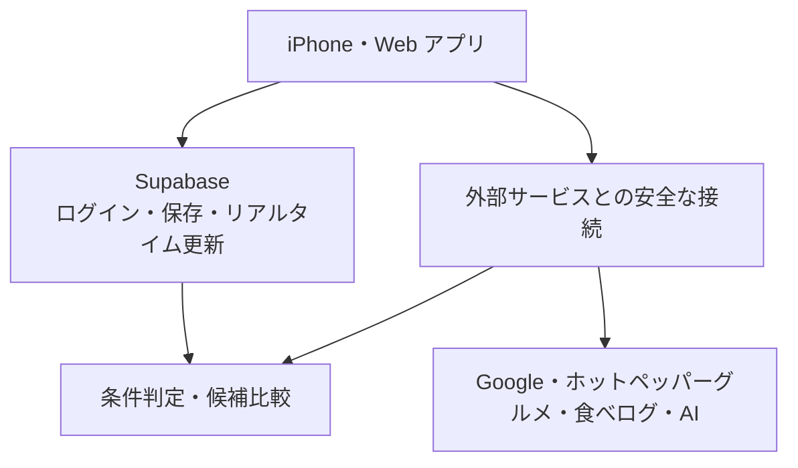

# まとメシ

## 店を「探す」AI ではなく、みんなで「決める」ための AI 幹事

> 参加者の希望を集めたら、全員の条件を満たす店は 0 件。
> まとメシは、誰かの条件を勝手に切り捨てません。影響を受ける本人にだけ、最小限の譲歩を打診します。
> 本人が同意すると、その場で再計算が走り、納得できる候補が 3 件に増えます。

まとメシは、複数人の会食で起きる「条件の衝突」「言いづらい事情」「幹事の負担」を解きほぐし、全員が納得できる店選びを支えるアプリです。

東京で 4〜8 人ほどの同僚や友人と行う飲み会・会食を想定しています。iPhone アプリと Web アプリのどちらからでも参加できます。

---

## まとメシが変える店選び

### 1. 「おすすめ」よりも、合意形成が主役

一般的な店探しサービスは、入力された条件から「おすすめの 1 店」を提示します。まとメシが引き受けるのは、その手前にある、もっと難しい問題です。

- 全員の必須条件を本当に満たしているか
- 誰か一人だけが移動や費用を我慢していないか
- 予算や出発地といった事情を、本人の名前と結び付けずに扱えるか
- 条件が衝突したとき、誰にどう相談すれば前に進むか
- 幹事が理由を理解したうえで、複数の選択肢から選べるか

### 2. 「0 件 → 相談 → 3 件」がリアルタイムで動く

複数の条件をそのまま組み合わせると、候補が 0 件になることがあります。

```text
候補 0 件
   ↓
条件を出した本人にだけ「『個室』を『半個室』まで緩めてもいいですか？」と打診
   ↓
本人が明示的に同意
   ↓
全員の画面がリアルタイムで更新
   ↓
異なる強みを持つ候補 3 件を表示
```

条件が勝手に書き換わることはありません。条件が変更されるのは、それを出した本人が同意したときだけです。

### 3. AI に任せる部分と、任せない部分

AI は、自由文を読み取って希望を整理する役割に限定しています。予算、移動時間、個室といった必須条件は、決まったルールで判定します。同じ入力なら、必ず同じ結果になります。

最終的に店を決めるのも、人間の幹事です。まとメシは判断を代行するのではなく、判断に必要な情報と、そこにたどり着くまでの合意形成を支えます。

---

## 解決したい課題

会食の店選びが難しいのは、店が少ないからではありません。参加者の事情が曖昧で、言いづらく、ときに両立しないからです。

- 「4,000 円以下」「個室」「駅から近い」など、譲れない条件が人によって違う
- 予算や出発地は、本人の名前と結び付けて共有したくない場合がある
- 「静か」「気軽」「和の雰囲気」など、検索欄には入れにくい希望がある
- 全条件を満たす店がないと、幹事が誰かに妥協をお願いすることになる
- 1 件だけを提示されても、なぜその店なのか、他にどんな選択肢があるのかが分からない

まとメシが向き合うのは店の検索ではなく、その背後にいる人たちの意思決定です。

## 想定する利用者

| 利用者 | 困っていること | まとメシが提供するもの |
| --- | --- | --- |
| 幹事 | 条件の収集、衝突の調整、候補の比較を一人で抱え込んでいる | 回答状況の一覧、候補件数、調整の提案、理由付きの複数候補 |
| 参加者 | 細かいフォームでは、自分の希望をうまく伝えられない | 日本語・英語の自由文入力と、解釈結果の確認 |
| プライバシーを重視する参加者 | 予算や出発地を、名前と結び付けて共有したくない | 公開・匿名・非公開の選択と、画面表示だけに頼らないデータベース側での保護 |

---

## まとメシでできること

1. 幹事がイベントを作り、招待リンクまたは QR コードを共有する
2. 参加者は匿名ログインですぐに始められる
3. 必須条件と希望条件を、日本語・英語の自由文で入力する
4. 「公開」「匿名」「非公開」から公開範囲を選ぶ
5. 参加者の回答状況と条件の追加をリアルタイムで共有する
6. 実在の店舗情報と移動時間を取得し、必須条件を判定する
7. 候補が 0 件なら、影響を受ける本人にだけ最小限の変更を提案する
8. 本人の同意を得てから、すべての画面で候補を再計算する
9. 「最も公平」「アクセス重視」「コスパ重視」「体験重視」など、強みの違う候補を並べて比べる
10. 人間の幹事が最終決定を下す

### 現在実装されている主な機能

- イベント作成、招待リンク、QR コードの生成・読み取り
- 匿名ログイン（必要に応じてメールアカウントへ移行可能）
- 自由文から必須条件・希望条件を整理する AI
- 公開・匿名・非公開の 3 段階のプライバシー設定
- Google Places による実在の店舗検索
- Google Routes による参加者ごとの公共交通の所要時間比較
- ホットペッパーグルメによる予算、個室、喫煙、写真の補完
- 食べログによる評価、口コミ件数、ディナー予算帯の実験的な補完
- 移動の負担、価格、希望の反映度、店の品質を切り分けた候補比較
- 本人にだけ届く条件調整の提案と、同意後の再計算
- 幹事だけが行える最終決定
- iPhone と Web のリアルタイム同期
- 外部サービスの API キーがなくても動く、ブラウザだけで試せるデモ

---

## なぜ Supabase を使うのか

まとメシでは、複数の参加者の入力が同時に更新されます。そこには予算や出発地など、慎重に扱うべき情報も含まれます。Supabase は、ログイン、データ保存、プライバシー保護、リアルタイム更新、外部サービスとの安全な接続を、一つの基盤にまとめられます。

| まとメシの機能 | Supabase の機能 | 役割とメリット |
| --- | --- | --- |
| 参加者のログイン | Supabase Auth | 匿名ですぐ参加でき、希望者はメールアカウントへ移行できます。全員に固有のユーザー ID が割り当てられるため、他人になりすます操作を防ぎます |
| イベントと条件の保存 | Supabase Postgres / Data API | 参加者、条件、候補店、移動時間、相談内容、候補の算出結果を一元的に保存します |
| 言いづらい条件の保護 | Row Level Security（RLS） | 参加者が読み書きできるのは、原則として自分の条件だけです。画面で隠すのではなく、データベース側で他人からの参照を遮断します |
| 全員の画面の同期 | Supabase Realtime | 条件の追加、候補の更新、入力の締切、最終決定を、画面の再読み込みなしで共有します。古い更新が新しい結果を上書きしない仕組みも備えています |
| 条件調整と最終決定 | Postgres Functions（RPC） | 「条件変更に同意できるのは本人だけ」「最終決定を下せるのは幹事だけ」というルールを、iPhone と Web に共通の仕組みとして担保します |
| Google・ホットペッパーグルメ・AI との接続 | Supabase Edge Functions / Secrets | API キーをアプリに置かず、利用者の認証、結果の整理、失敗時の処理を一か所にまとめます |
| 検索結果の再利用 | Supabase Postgres | 条件が変わるたびに外部サービスへ問い合わせるのではなく、取得済みの店舗・移動情報からすばやく再計算します |
| 曖昧な希望の検索（将来） | pgvector | 「落ち着いた店」のような分類しにくい希望を扱う準備があります。現在は未実装で、必須条件の判定には使いません |

### API キーをアプリ側に置かない

Google Places、Google Routes、ホットペッパーグルメ、言語モデルの API キーは Supabase Secrets に保存します。iPhone アプリと Web アプリは各サービスを直接呼び出さず、必ず Supabase Edge Functions を経由します。Edge Functions がログイン済みの利用者かどうかを確認したうえで外部サービスへ問い合わせるため、アプリの解析やブラウザの開発者ツールから API キーが漏れるリスクを抑えられます。

### プライバシーを守る仕組み

- **公開**：名前と条件をグループに表示します
- **匿名**：条件は共有しますが、誰の条件かは表示しません
- **非公開**：本人以外の画面にも、リアルタイム通知にも流しません
- 予算や出発地などは、画面表示だけでなくデータベース側でも慎重な情報として扱います
- 最終決定を下せるのは幹事だけです。幹事以外の操作や、イベント外の店舗が選ばれないことは、テストで検証しています

## 全体の仕組み



---

## 候補の選び方

まとメシは、すべてを一つの「AI おすすめ度」に混ぜません。利用者と幹事が理由をたどれるよう、次の観点を分けて表示します。

| 観点 | 確認すること |
| --- | --- |
| 必須条件 | 全員の譲れない条件を満たしているか |
| 公平さ | 移動、費用、アクセシビリティの負担が一人に偏っていないか |
| 希望の満足度 | 各参加者の「できれば」をどの程度かなえているか |
| 店の品質 | 評価と口コミ件数から見て、候補の中でどの位置にあるか |
| 情報の確かさ | 確認済み、未確認、不明、矛盾のどれか |

Google と食べログでは評価の付け方が異なるため、星の数字をそのまま平均することはしません。それぞれのサービス内で候補を相対評価してから組み合わせ、片方に情報がない店を不当に減点しないようにしています。

## 「一番近い店」ではなく、「全員に公平な店」

中心地点から近いという理由だけで店を選ぶと、特定の一人だけが長時間の移動を強いられがちです。まとメシは Google Routes から参加者ごとの公共交通の所要時間を取得し、候補ごとの移動負担を比較します。

- 平均の所要時間だけでなく、最も遠い参加者の負担も候補比較に反映します
- 移動負担は店の品質や価格と分けて表示し、「誰か一人の我慢」が数字に埋もれないようにします
- 開催日が先でも、参加者はいまの想定出発地を登録できます。締切前ならいつでも変更できます
- 条件が変わったあとは、保存済みの経路情報を使って候補をすばやく再計算します

幹事が「全体では便利そう」という印象だけで決めるのではなく、参加者ごとの負担を理解したうえで選べるようにします。

---

## 使用している技術

| 領域 | 技術 |
| --- | --- |
| iPhone アプリ | Swift、SwiftUI |
| Web アプリ | React、TypeScript、Vite、PWA |
| バックエンド | Supabase |
| 店舗・移動情報 | Google Places、Google Routes、ホットペッパーグルメ |
| 実験的な店舗情報の補完 | 食べログ |
| 自由文の整理 | OpenAI 互換の言語モデル |

技術構成の詳細は、[iPhone アプリ・バックエンドの説明](./AIKanji/README.md)（英語）と [Web アプリの説明](./web/README.md)（英語）を参照してください。

## 開発における Devin の役割

まとメシは、Devin をコードを書くエージェントとしてだけでなく、実装・レビュー・検証を通した開発の担い手として使っています。人間が担うのは、仕様を決めること、レビューの最終判断、そしてマージです。

### 1. 実装

機能ごとにセッションを立て、Devin がブランチとプルリクエストを作ります。このリポジトリのプルリクエストの大半は、Devin のセッションから生まれたものです。

### 2. コードレビュー

GitHub 連携により、Devin がプルリクエストに直接レビューコメントを付けます。人間のレビューを置き換えるものではなく、その前段で明らかな不具合や見落としを拾う役割です。

### 3. 動かしての検証

Devin はコードを読むだけでなく、実際に動かして確かめます。

- **iOS**：シミュレータでビルドし、XCTest と UI テストを実行します
- **Web**：Chrome DevTools Protocol 経由でブラウザを操作し、一連の流れ、P0 機能、リアルタイム配信を検証します（`web/scripts/`）
- **バックエンド**：使い捨ての PostgreSQL コンテナにすべてのマイグレーションとデモ用データを適用し、権限と条件判定のテストを実行します（`AIKanji/supabase/tests/`）

このうち GitHub Actions でも同じように動くのは、バックエンドのテストと、TypeScript 側の判定ロジックが SQL 側と一致していることの確認です。iOS は CI ではビルドのみを行い、テストの実行は手元に限られます（実データベースとシミュレータが必要なためです）。ブラウザでの検証も、実際に動いている Supabase に対して 手元で実行します。CI が最後の砦なのではなく、CI で追い切れない部分を手元の検証が埋めている、という関係です。

### 4. 拡張：API による iOS・Web 間の機能同期

> このしくみは計画段階であり、まだ実装されていません。

まとメシには、SwiftUI で作られた iPhone アプリと、React で作られた Web アプリがあります。片方だけに新しい機能や画面の変更を加えると、もう片方への反映が漏れ、使える機能や体験に差が生まれます。

これまでの 1〜3 は、人間がセッションを立てることが起点でした。その起点そのものを自動化するのが、この計画です。GitHub Actions と Devin API（v3）を組み合わせ、変更の検知からもう片方のクライアントへの反映までをつなぎます。

#### 同期の流れ

1. Web または iOS の変更が GitHub に push される
2. GitHub Actions が、変更されたファイルと対象クライアントを判定する
3. GitHub Actions が Devin API を呼び出し、新しいセッションを開始する
4. Devin が変更内容、共通の仕様、既存のテストを読む
5. Devin が、もう片方のクライアントにも対応が必要かを判断する
6. 必要な機能や画面を、各プラットフォームに合った形で実装する
7. テストを実行し、レビュー用の Draft PR を作成する
8. 人間が内容を確認し、承認したものだけをマージする

React と SwiftUI では画面の構成も操作の作法も異なるため、見た目をそのまま複製することは目指しません。揃えるのは、機能・情報・操作の流れです。

両クライアントが共有している仕様は、Supabase の RPC と Realtime のインターフェースです。必須条件の判定も、条件変更に同意できる人も、最終決定を下せる人も、すべてデータベース側で決まります。同期の対象になるのは画面と操作であって、ルールそのものではありません。

#### このしくみで狙うこと

- iOS と Web の機能差を早い段階で見つけられる
- もう片方のクライアントへの実装漏れを減らせる
- 同じ仕様を二度説明し、別々に実装する手間を減らせる
- 差分の確認から実装、テスト、PR の作成までを継続的に任せられる
- マージの前に人間の確認を残し、意図しない変更を防げる

#### 起動条件と認証情報の扱い

Devin の API キー（v3 のサービスユーザーキー）と Organization ID は GitHub Secrets に保存し、リポジトリにもログにも残しません。

すべてのコミットで Devin を起動することはしません。対象ファイル、PR ラベル、手動実行で起動条件を絞ります。Devin 自身が作成した PR は検知の対象から外し、同期が次の同期を呼ぶ繰り返しを防ぎます。

## リポジトリ構成

```text
.
├── AIKanji/                  iPhone アプリと Supabase バックエンド
│   ├── AIKanji/              アプリ本体
│   ├── Tests/                アプリのテスト
│   └── supabase/
│       ├── functions/        外部サービス・AI との接続
│       ├── migrations/       データ構造、権限、条件判定
│       ├── tests/            データベースと権限のテスト
│       └── seed.sql          デモ用データ
├── web/                      Web アプリとデモ検証
└── .github/workflows/ci.yml  自動テスト
```

## すぐにデモを試す

外部サービスの認証情報がなくても、ブラウザから一連の流れを確認できます。

```bash
cd web
npm install
npm run dev
```

表示されたローカル URL を開き、招待コード `demo01` を入力してください。Supabase の設定がない場合は、自動的にデモ用データへ切り替わります。

---

## 今後のロードマップ

### 優先度 1：次に完成させる機能

| 項目 | 現在 | 次に行うこと |
| --- | --- | --- |
| 曖昧な希望の意味検索 | 未実装 | 「落ち着いた」「会話しやすい」など、分類表だけでは拾えない希望を候補比較に加える |
| 候補の多様化 | 一部実装 | 似た店ばかりにならないよう、価格・公平さ・体験の違いがはっきりした 3〜5 件を選ぶ |
| 店舗情報の確認アシスタント | 基盤のみ | 個室の空き、営業時間、予約条件を電話で確認するための日本語文と連絡先を用意し、回答と確認日を記録して結果を再計算する |
| 任意の投票 | 未実装 | 幹事が 2〜5 件を公開し、一人 1 票で投票する。集計はリアルタイムで表示する |
| 予約・連絡への引き継ぎ | 未実装 | 予約ページや電話への確実な導線をつくり、予約内容と状態を保存する |
| 人数・出欠の変更 | 一部実装 | 決定後の人数変更が店選びに与える影響を示し、店舗への連絡や変更を支援する |
| iOS・Web 間の機能同期 | 未実装 | GitHub Actions で変更を検知し、Devin API から同期セッションを開始する。もう片方のクライアントへ必要な変更を実装し、テスト済みの Draft PR まで用意する |

### 優先度 2：将来の拡張

- TableCheck などを使った空席確認と直接予約
- 予約の作成、変更、取消
- LINE とカレンダーへの連携
- 口コミを使った、希望条件のより詳しい比較
- 外部データの障害を再現し、修正案を作る Devin の自動化
- 同意の取得、記録、失敗時の対応を整えたうえでの自動電話

## 本番公開前に残る課題

- **食べログ**：公式 API が提供されていないため、情報取得は実験的な位置づけです。商用・本番での利用にあたっては、利用条件の確認と、提携または法務確認が必要です。このデモでは既定で有効になっており、無効にするには `TABELOG_ENRICHMENT_ENABLED` に `false` を設定します
- **Google の帰属表示**：iPhone アプリと Web アプリの候補一覧の画面には表示済みです。移動の起点を選ぶ画面にも追加する必要があります（この画面では店舗名を Google から取得して表示しているためです）。ロゴ画像を使うかどうかの判断も残っています
- **空席・予約可否**：現在の店舗検索サービスだけではリアルタイムの空席を確定できません。予約サービスとの連携か、店舗へ確認する流れが必要です

---

## まとメシが守る約束

- 最後に決めるのは、人間の幹事
- 必須条件は、本人の明示的な同意なしに変更しない
- 分からない情報を、確認済みのように見せない
- AI に必須条件の最終判定を丸投げしない
- 言いづらい条件の持ち主を、幹事やグループに漏らさない
- 外部サービスが止まっても、イベントそのものは壊れない

## ライセンス

[ライセンス](./LICENSE) を参照してください。
